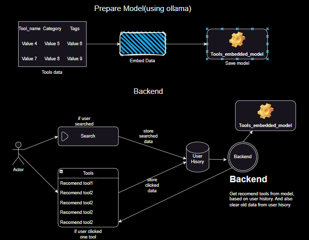
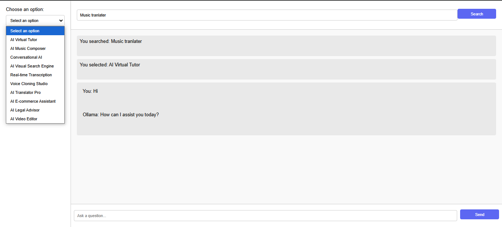

# Demo AI tool Recomendation system using LLM


## Basic System design
<div style="text-align: center;">
    
</div>

## Run Demo 
**Note**

- 1st. Extract files from data.zip
- 2nd. On local run ollama
- 3rd. Install models:
-       Embedding model: ollama run nomic-embed-text:latest
-       Chat model: ollama run llama3.2:3b

<br>

```shell
python app.py 
```




<br/>

## Make Embedded model for Tool categories 


   ```shell
   Run embedModel.ipynb file.
   ```


<br/>